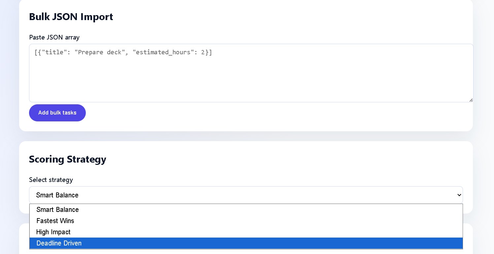
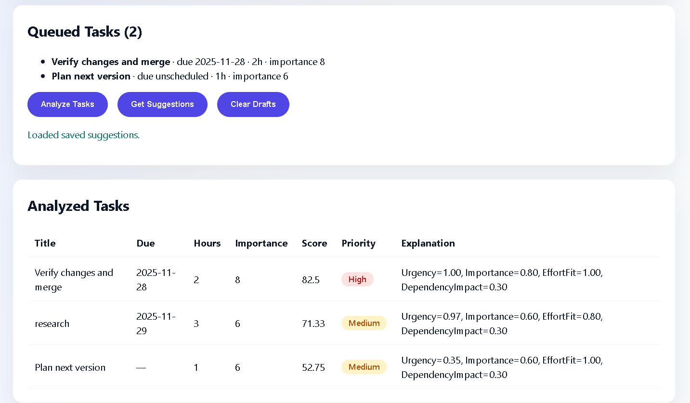

# Smart Task Analyzer

Full-stack reference implementation of the Smart Task Analyzer:

- **Backend**: Django 4.2 + Django REST Framework, MongoDB via PyMongo (no ORM)
- **Frontend**: React (Vite)
- **Database**: MongoDB collection `task_analyzer_db.tasks`

## Project Structure

```
task-analyzer/
├── backend/
│   ├── manage.py
│   ├── task_analyzer/
│   └── tasks/
├── frontend/
│   ├── index.html
│   └── src/
└── README.md
```
## UI






## Backend Setup

1. Create a virtual environment and install dependencies:

   ```bash
   cd task-analyzer/backend
   python -m venv .venv
   .venv\Scripts\activate  # Windows
   pip install -r requirements.txt
   ```

2. Configure environment variables (optional) in `backend/.env`:

   ```
   SECRET_KEY=super-secret
   DEBUG=true
   MONGO_URI=mongodb://localhost:27017/
   ALLOWED_HOSTS=localhost,127.0.0.1
   ```

3. Run the development server:

   ```bash
   python manage.py runserver
   ```

### Scoring Algorithm Explained

The Smart Task Analyzer converts raw task metadata into a single numeric priority score.  
It evaluates due dates, importance, effort, dependencies, and even cyclic relationships.  
Below is a clean breakdown of every component in the scoring system.

---

## 1. `Input Normalization`

Each task is first normalized into a predictable structure:

- `due_date` is parsed using the format `YYYY-MM-DD`.
- Missing or invalid dates become `None`.
- `importance` is scaled from a `1–10` integer into a `0–1` float.
- `estimated_hours` is converted to an integer.
- `dependencies` always becomes a list of task titles.

This ensures the scoring engine works on clean, validated input.

---

## 2. `Dependency Graph Construction`

The system builds a graph:

task_title → [list of tasks it depends on]


This enables detection of:

- Tasks blocked by multiple other tasks  
- Missing/unknown dependencies  
- Cycles such as `A → B → A`

---

## 3. `Cycle Detection`

Cyclic relationships are detected using a DFS (depth-first search).  
The algorithm tracks:

- `visited` — tasks that have been fully processed  
- `stack` — tasks in the current DFS chain  
- `cyclic` — tasks participating in at least one dependency loop  

If a node is encountered twice in the DFS stack, every task in that chain is marked cyclic.

**Cycle penalty applied:**

0.3 subtracted from the final composite score

This prevents circular tasks from being incorrectly ranked high.

---

## 4. `Dependency Pressure` (Blocking Impact)

The analyzer inverts the dependency graph:

task_title → number of tasks that depend on it


This measures how many tasks get unblocked when a given task is completed.

| Dependents | Score |
|-----------|--------|
| 0         | 0.3    |
| 1         | 0.6    |
| 2+        | 0.6 + (n-1) × 0.15 (capped at 1.0) |

This models the real-world rule:

> “Tasks that unblock multiple other tasks should be done earlier.”

---

## 5. `Urgency Score`

Urgency is calculated from the due date:

- No due date → `0.35` (moderate priority)
- Due today → `1.0`
- Overdue → boosted (maximum `1.5`)
- Future tasks → linear decay over a 30-day window

Formula:

urgency = 1 - (days_out / 30)


Clamped to a minimum of `0.2`.

---

## 6. `Effort Score`

Effort is converted into a "quick-win friendliness" score:

| Hours | Effort Score |
|-------|--------------|
| 0–2   | 1.0 |
| 3–6   | 0.8 |
| 7–12  | 0.6 |
| 12+   | 0.4 |

Shorter tasks get rewarded because they improve throughput.

---

## 7. `Final Composite Score`

All four components are combined using fixed weights:

urgency * 0.35

importance * 0.35

effort * 0.15

dependency * 0.15

penalty (cycle penalty)


Then the score is scaled:

final_score = composite * 100


Each task also includes a human-readable explanation:

"Urgency=0.92, Importance=0.80, EffortFit=0.60, DependencyImpact=0.45"


---

## 8. Sorting Strategies

After scoring, tasks are ranked according to the user’s chosen strategy:

### a. `fastest_wins`
Sort by:
1. lowest `estimated_hours`
2. highest `score`

### b. `high_impact`
Sort by:
1. highest `importance`
2. highest `score`

### c. `deadline_driven`
Sort by earliest `due_date` (missing dates pushed last)

### d. `smart_balance` (default)
Sort by final composite `score` in descending order.

---

## Overall Goal

The algorithm aims to replicate realistic human prioritization by balancing:

- Time pressure  
- Strategic impact  
- Completion momentum (quick wins)  
- Workflow unblocking  
- Dependency complexity  

Every score component is explainable, making the system transparent, auditable, and easy to tune.

### MongoDB Notes

- Ensure MongoDB is running locally or adjust `MONGO_URI`.
- The app never touches Django's ORM; it writes documents directly to `db.tasks`.

### API Endpoints

`POST /api/tasks/analyze/`

```json
{
  "tasks": [
    {
      "title": "Draft roadmap",
      "due_date": "2025-12-01",
      "estimated_hours": 4,
      "importance": 8,
      "dependencies": ["Collect metrics"]
    }
  ],
  "strategy": "smart_balance"
}
```

Response:

```json
{
  "strategy": "smart_balance",
  "results": [
    {
      "title": "Draft roadmap",
      "due_date": "2025-12-01",
      "estimated_hours": 4,
      "importance": 8,
      "dependencies": ["Collect metrics"],
      "score": 82.35,
      "explanation": "Urgency=0.88, Importance=0.80, EffortFit=0.80, DependencyImpact=0.45"
    }
  ]
}
```

`GET /api/tasks/suggest/` — rescoring of the most recently saved tasks, returning the top three.

## Scoring Overview

The Smart Task Analyzer produces a composite score:

- **Urgency**: Days to deadline, with overdue tasks boosted.
- **Importance**: 0-10 scale normalized.
- **Effort**: Rewards quick-win work items.
- **Dependency Impact**: Tasks that unblock multiple dependents rank higher.
- **Circular Dependency Detection**: Cycles incur penalties.

Scores are multiplied by 100 and sorted via one of four strategies:

`fastest_wins`, `high_impact`, `deadline_driven`, `smart_balance`.

## Frontend Setup

1. Install dependencies:

   ```bash
   cd task-analyzer/frontend
   npm install
   ```

2. Run the Vite dev server (auto-proxies `/api` to Django):

   ```bash
   npm run dev
   ```

3. Build for production:

   ```bash
   npm run build
   npm run preview
   ```

## Running the Full Stack

1. Start MongoDB (`mongod`).
2. Run Django backend (`python manage.py runserver`).
3. In a separate terminal, run the React frontend (`npm run dev`).
4. Navigate to `http://localhost:5173`.

Use the UI to add tasks individually or via JSON, pick a strategy, analyze, and request suggestions based on previously scored work. All persistence happens through MongoDB collections managed by PyMongo.

