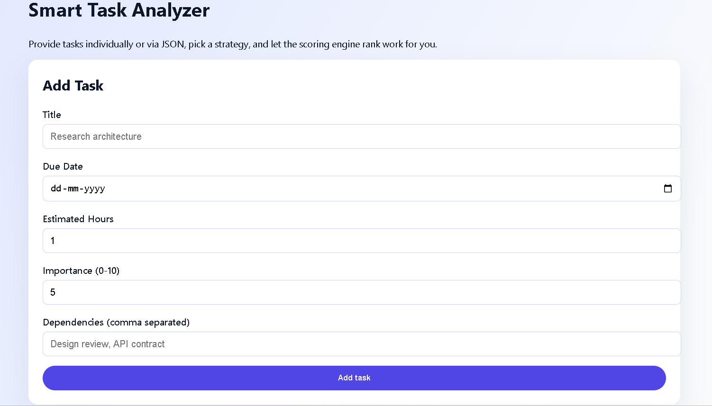

# Smart Task Analyzer

Full-stack reference implementation of the Smart Task Analyzer:

- **Backend**: Django 4.2 + Django REST Framework, MongoDB via PyMongo (no ORM)
- **Frontend**: React (Vite)
- **Database**: MongoDB collection `task_analyzer_db.tasks`

## Project Structure

```
task-analyzer/
├── backend/
│   ├── manage.py
│   ├── task_analyzer/
│   └── tasks/
├── frontend/
│   ├── index.html
│   └── src/
└── README.md
```
## UI




## Backend Setup

1. Create a virtual environment and install dependencies:

   ```bash
   cd task-analyzer/backend
   python -m venv .venv
   .venv\Scripts\activate  # Windows
   pip install -r requirements.txt
   ```

2. Configure environment variables (optional) in `backend/.env`:

   ```
   SECRET_KEY=super-secret
   DEBUG=true
   MONGO_URI=mongodb://localhost:27017/
   ALLOWED_HOSTS=localhost,127.0.0.1
   ```

3. Run the development server:

   ```bash
   python manage.py runserver
   ```

### MongoDB Notes

- Ensure MongoDB is running locally or adjust `MONGO_URI`.
- The app never touches Django's ORM; it writes documents directly to `db.tasks`.

### API Endpoints

`POST /api/tasks/analyze/`

```json
{
  "tasks": [
    {
      "title": "Draft roadmap",
      "due_date": "2025-12-01",
      "estimated_hours": 4,
      "importance": 8,
      "dependencies": ["Collect metrics"]
    }
  ],
  "strategy": "smart_balance"
}
```

Response:

```json
{
  "strategy": "smart_balance",
  "results": [
    {
      "title": "Draft roadmap",
      "due_date": "2025-12-01",
      "estimated_hours": 4,
      "importance": 8,
      "dependencies": ["Collect metrics"],
      "score": 82.35,
      "explanation": "Urgency=0.88, Importance=0.80, EffortFit=0.80, DependencyImpact=0.45"
    }
  ]
}
```

`GET /api/tasks/suggest/` — rescoring of the most recently saved tasks, returning the top three.

## Scoring Overview

The Smart Task Analyzer produces a composite score:

- **Urgency**: Days to deadline, with overdue tasks boosted.
- **Importance**: 0-10 scale normalized.
- **Effort**: Rewards quick-win work items.
- **Dependency Impact**: Tasks that unblock multiple dependents rank higher.
- **Circular Dependency Detection**: Cycles incur penalties.

Scores are multiplied by 100 and sorted via one of four strategies:

`fastest_wins`, `high_impact`, `deadline_driven`, `smart_balance`.

## Frontend Setup

1. Install dependencies:

   ```bash
   cd task-analyzer/frontend
   npm install
   ```

2. Run the Vite dev server (auto-proxies `/api` to Django):

   ```bash
   npm run dev
   ```

3. Build for production:

   ```bash
   npm run build
   npm run preview
   ```

## Running the Full Stack

1. Start MongoDB (`mongod`).
2. Run Django backend (`python manage.py runserver`).
3. In a separate terminal, run the React frontend (`npm run dev`).
4. Navigate to `http://localhost:5173`.

Use the UI to add tasks individually or via JSON, pick a strategy, analyze, and request suggestions based on previously scored work. All persistence happens through MongoDB collections managed by PyMongo.

